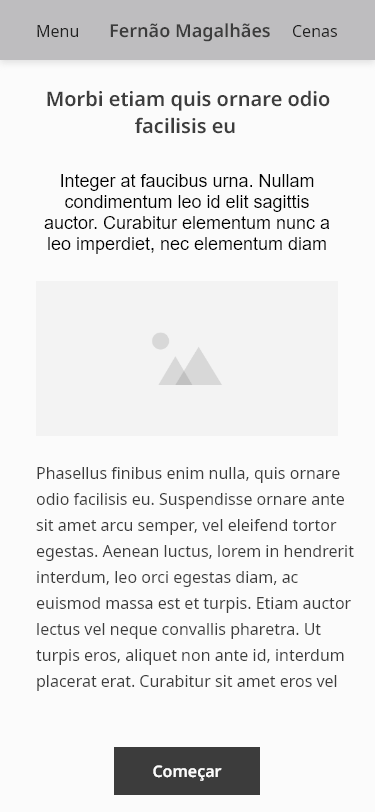
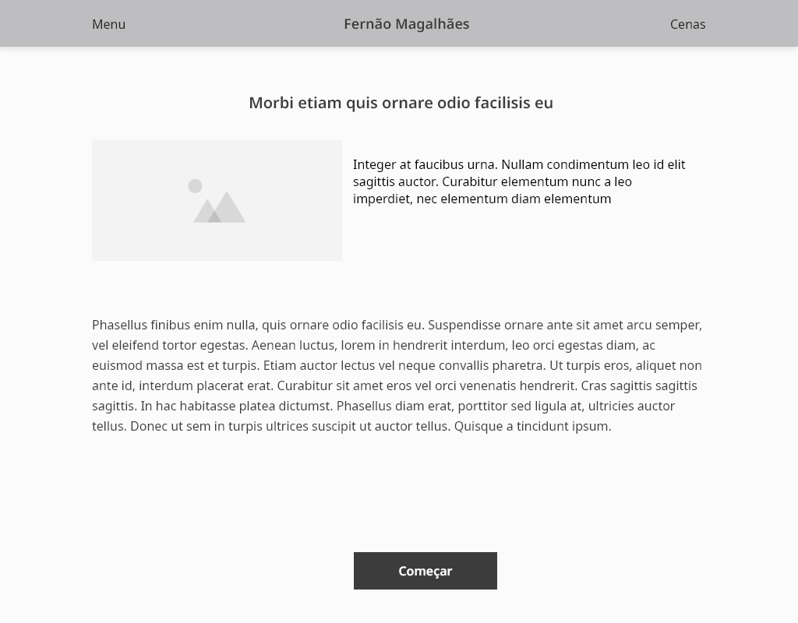
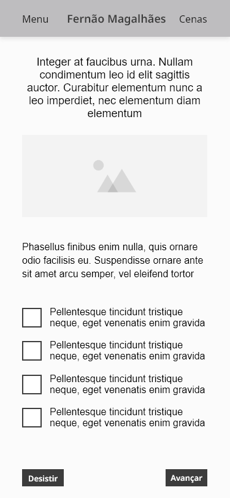
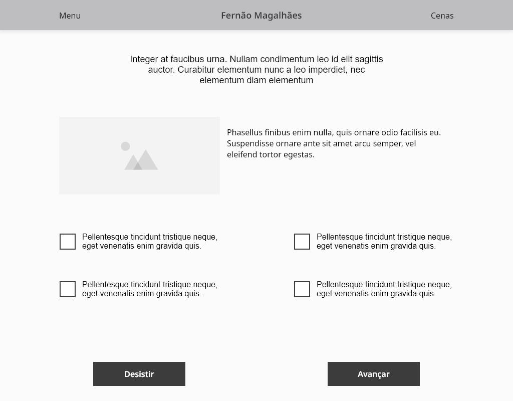

# Fernão Magalhães 

Um aplicativo para a apresentaçao de um jogo sobre a viagem de **Fenão Magalhães**.

## Como Iniciar

### Dependencias:
   - Python3.6+
   - [kivy](https://kivy.org/#home) 
   
Primeiro tenha a certeza que tem python3.6 ou maior instalado. 

No ubuntu, abra um terminal e roda o seguinte comando:

`python3 --version`

Cria uma pasta onde queiras trabalhar nela. Dentro da mesma pasta executa os seguintes comandos.

 1. Copiar o projeto no github para a sua pasta
 
    `git clone https://github.com/devjame/fernao_magalhaes.git`

 2. Entrar na pasta copiada
 
    `cd fernao_magalhaes`
    
 3. Criar um ambiente virtual para instalar os modulos do python
 
    `python3 -m pip install --user virtualenv`
    
    `virtualenv venv`

 4. Ativar o ambiente virtual que criaste
 
    `source venv/bin/activate`

 5. Instalar os modulos para poder trabalhar com o projeto
 
    `pip install -r requirements.txt`
    
 6. Pode executar o programa com o seguinte comando:
 
    `python main.py`
    
 ### Assets do Projeto
 
 Ecrã Home
 
 
 
 
 
 Ecrã Quiz
 
 
 
 
 
 
Copyright [@devjame](https://github.com/devjame)